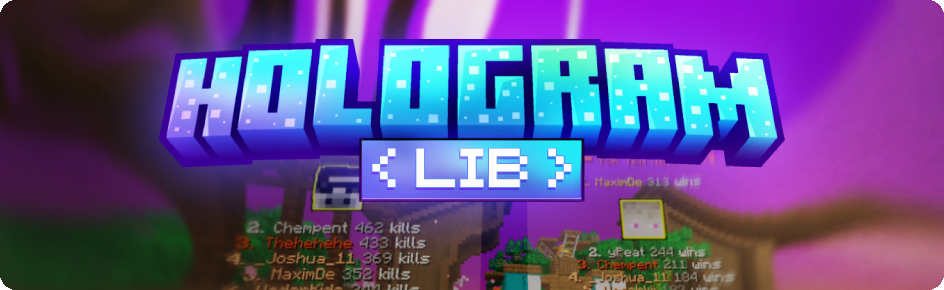

<div align="center">
  
  
  [](https://discord.gg/2UTkYj26B4)
  [](https://github.com/HologramLib/HologramLib/wiki)
  [](https://jitpack.io/#HologramLib/HologramLib)
  [](https://HologramLib.github.io/HologramLib/)
  [](https://github.com/HologramLib/HologramLib/releases)


  <p>Leave a :star: if you like this library :octocat:</p>
  <h3>Display Entity Based Hologram Library</h3>
  <p>Packet-based • Feature-rich • Developer-friendly</p>
</div>

---

1. [Installation](https://github.com/HologramLib/HologramLib/wiki/1.-Installation)  
2. [Getting Started](https://github.com/HologramLib/HologramLib/wiki/2.-Getting-Started)  
   - [Creating Holograms](https://github.com/HologramLib/HologramLib/wiki/3.-Creating-Holograms)  
   - [Hologram Management](https://github.com/HologramLib/HologramLib/wiki/4.-Hologram-Management)  
   - [Leaderboards](https://github.com/HologramLib/HologramLib/wiki/5.-Leaderboards)  
   - [Animations](https://github.com/HologramLib/HologramLib/wiki/6.-Animations)  

<a href="https://github.com/HologramLib/HologramLib/releases/download/1.8.3/HologramLib-1.8.3.jar">
  
</a>


## Features
- **Types**    
Text • Blocks • Items • Leaderboards • Paginated Leaderboards  

- **Dynamic Content**  
Live animations • MiniMessage formatting • ItemsAdder emojis • PlaceholderAPI

- **Mechanics**  
Entity attachment • Per-player visibility • View distance control    

---

## ⚙️ Technical Specifications

**Compatibility**  
| Software | Versions       | 
|-----------------|--------------------------|
| **Paper**       | 1.19.4 → 1.21.8 ✔️       |
| **Purpur**      | 1.19.4 → 1.21.8 ✔️       | 
| **Folia**       | 1.19.4 → 1.21.8 ✔️       | 
| **Spigot**      | ❌ Not supported         | 
| **Bedrock**     | ❌ Not supported         | 
| **Legacy**      | ❌ (1.8 - 1.19.3)        | 

**Dependencies**  
- [PacketEvents](https://www.spigotmc.org/resources/80279/) (Required)

If you want to learn how to use HologramLib in your plugin, check out the detailed guide here:  
👉 [HologramLib Wiki](https://github.com/HologramLib/HologramLib/wiki)

---

## Integration

**Step 1: Add Dependency**
```gradle
repositories {
    maven { url 'https://jitpack.io' }
}

dependencies {
    implementation 'com.github.HologramLib:HologramLib:1.8.5'
}
```

**Step 2: Basic Implementation**
```java
HologramManager manager = HologramAPI.getManager().get();

TextHologram hologram = new TextHologram("unique_id")
    .setMiniMessageText("<aqua>Hello world!")
    .setSeeThroughBlocks(false)
    .setShadow(true)
    .setScale(1.5F, 1.5F, 1.5F)
    .setTextOpacity((byte) 200)
    .setBackgroundColor(Color.fromARGB(60, 255, 236, 222).asARGB())
    .setMaxLineWidth(200);

manager.spawn(hologram);
```

---

## Resources


| Resource | Description | 
|----------|-------------|
| [📖 Complete Wiki](https://github.com/HologramLib/HologramLib/wiki) | Setup guides • Detailed examples • Best practices |
| [💡 Example Plugin](https://github.com/HologramLib/ExamplePlugin) | Production-ready implementations |
| [🎥 Tutorial Series](https://github.com/HologramLib/HologramLib) | Video walkthroughs (Coming Soon) |

---

## Featured Implementations
- **TypingInChat** ([Modrinth](https://modrinth.com/plugin/typinginchat-plugin)) - Real-time typing visualization

*[Your Project Here 🫵]* - Submit via PR or <a href="https://discord.gg/2UTkYj26B4">Discord</a>!

---

## Roadmap
**2026**
- Switch from resourcepack to playerhead components
- Switch back to single text holograms for leaderboards - dont split lines
- More options for leaderboard holograms
- Interactive holograms
- Improved animation system
- Persistant holograms
- - Particle-effect holograms


> [!WARNING]
> Persistant holograms & the addon system are still experimental features

## Contributors
Contributions to this repo or the example plugin are welcome!

<!-- CONTRIBUTORS:START -->

| Avatar | Username |
|--------|----------|
| [](https://github.com/maximjsx) | [maximjsx]( https://github.com/maximjsx ) |
| [](https://github.com/feeeedox) | [feeeedox]( https://github.com/feeeedox ) |
|  | [misieur]( https://github.com/misieur ) |
| [](https://github.com/WhyZerVellasskx) | [WhyZerVellasskx]( https://github.com/WhyZerVellasskx ) |
| [](https://github.com/RootException) | [RootException]( https://github.com/RootException ) |
| [](https://github.com/parallela) | [parallela]( https://github.com/parallela ) |
| [](https://github.com/matt11matthew) | [matt11matthew]( https://github.com/matt11matthew ) |

<!-- CONTRIBUTORS:END -->

**Used by:**
| Server |   |
|--------|----------|
| [rangemc]( https://www.rangemc.net/ ) |  | 
| [hysteria]( https://hysteria-gaming.org/ ) |  | 

<div align="center"><sup>Live Statistics</sup></div>

[](https://bstats.org/plugin/bukkit/HologramAPI/19375)

---

<div align="center">

  <a alt="o7studios" href="https://o7.studio"></a>
  
  <sub>Used by 100+ servers | 10,000+ downloads across platforms</sub><br>
  <a href="https://www.spigotmc.org/resources/111746/">SpigotMC</a> •
  <a href="https://hangar.papermc.io/maximjsx/HologramLib">Hangar</a> •
  <a href="https://modrinth.com/plugin/hologramlib">Modrinth</a> •
  <a href="https://maximjsx.com/projects/hologramlib">Maxim.jsx</a> •
  <a href="https://github.com/HologramLib/HologramLib/releases/latest">Latest Release</a> •
  <a href="https://discord.gg/2UTkYj26B4">Support</a><br>
  <sub>License: GPL-3.0 | © 2026 <a href="https://github.com/maximjsx/">Maxim</a></sub>
</div>

